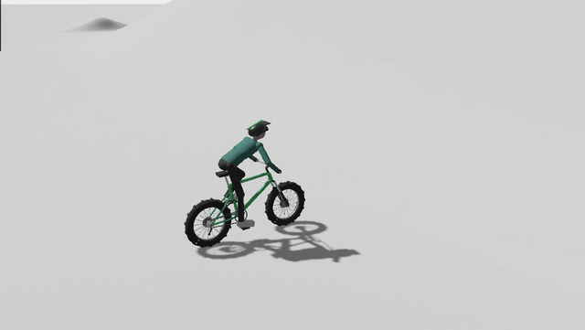
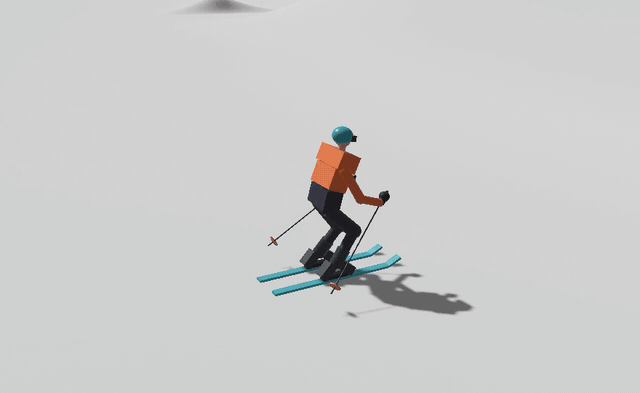

# RustRepublic

**Freestyle mountain-bike and ski physics in Rust + Bevy.** Backflips, barrel rolls,
tailwhips, 540 grabs, carving, V-skating, real crashes into a ragdoll. It runs on the
desktop, or in the browser over WebGPU.

| Bike freestyle | Ski freestyle |
| :---: | :---: |
|  |  |
| [Full bike showcase loop (mp4, 100 s)](docs/media/bike-showcase.mp4) | [Full ski showcase loop (mp4, 90 s)](docs/media/ski-showcase.mp4) |

> [!IMPORTANT]
> **No game code, and no game needed.** Everything in this repository was written from
> scratch for this project: physics, skeletons, animation, rendering and camera. It
> contains no code, assets, models, animations or data from Riders Republic, and it never
> loads any game files. You do not need to own or install the game to build or play it.
>
> It is a fan project inspired by Riders Republic and is not affiliated with or endorsed by
> Ubisoft. Some poses, body proportions and timings were tuned against measurements taken
> from the game's own videos and animation files on a locally installed copy, the way an
> animator studies reference footage. Only our own numbers went into the code, never game data.

## Play

```sh
cargo run --locked --release
```

You need Rust 1.88+, a C compiler, Linux X11/Wayland development libraries and a
Vulkan driver. Press **F6** to watch the automatic trick showcase, **5** to switch to
skis, **1–4** for the bikes.

### In the browser (WebGPU)

```sh
scripts/web.sh        # builds target/www (index.html + JS + wasm)
```

Serve `target/www` over HTTPS or `localhost`, for example with `tailscale serve`,
`python -m http.server` or any static host, and open it in a recent Chrome, Edge or
Safari. You need the `wasm32-unknown-unknown` target and
`wasm-bindgen-cli 0.2.129`, the same version as in `Cargo.lock`.

The page opens straight into the looping ski showcase. Phones are view-only: there are
no on-screen buttons, so you watch the showcase and move the camera, but can't ride.
- **Portrait:** the view widens instead of cropping the sides, and the camera looks down
  so the tall screen shows snow rather than sky.
- **HUD:** the panels shrink, and the key help is hidden.
- **Touch:** drag with one finger to orbit, pinch to zoom.

## What's in it

**Bike**: four disciplines (Downhill, Road, Slopestyle, Freeride), each with its own
suspension, power, grip and look.
- **Physics:** a fixed 120 Hz two-wheel model with pedalling, sprinting, braking,
  wheelies and manuals.
- **Rotations:** flips, barrel rolls and spins are the bike's actual momentum. There are
  no canned rotations, so you can under-rotate and crash.
- **Tricks:** hand, foot and bike tricks combine freely, with left/right variants.
  Superman, can-can, nac-nac, tailwhip, barspin, table, X-up, turndown, Euro table,
  invert, crankflip and more.
- **Rider:** pedals with hip sway and ankle motion, and leans and flares the knee into
  corners. The bike rocks under a sprint. Landings absorb through the arms and legs.

**Ski**:
- **Riding:** carving with angulation and upper/lower-body separation, hockey stops,
  snowplow, tuck and switch riding.
- **Flat ground:** V-skating and double poling, with cadence and speed gain tied to each
  push.
- **Air:** jumps with a preload crouch and pop, free-rotation spins and flips, and nine
  grabs (Mute, Safety, Japan, Tail, Tip, Truck Driver, Daffy, Spread Eagle, Iron Cross).
- **Landings:** wide-stance absorb and a short skid.

**Both**:
- **Crashes:** a bad landing, a hard impact or a body strike throws the rider into an
  articulated ragdoll.
- **Smooth motion:** the rendered pose blends between physics ticks, and every animation
  blend is a critically damped spring, so nothing snaps.
- **Camera:** a chase camera follows your direction of travel rather than the spinning
  body. Its field of view widens with speed, and it lifts over terrain instead of
  clipping into it.
- **F6 showcase:**
  - **Bike:** Superman → backflip → frontflip → barrel roll → no hands + no feet →
    barspin + tailwhip → table → a deliberate crash.
  - **Ski:** 360 Mute → backflip Safety → 540 Japan → Daffy → an incomplete front flip.
- **Debug views:** F1 skeleton overlay, F2 skeleton-only.

## Controls

| | Bike | Ski |
| --- | --- | --- |
| Move | W pedal · S brake · A/D steer · Shift sprint | W skate/double-pole · S plow/hockey stop · A/D carve · Shift tuck |
| Jump | Space hop · Q wheelie · Z/X manuals | Space: hold to crouch, release to jump |
| Air | Arrows flip/roll · E/T spin · Ctrl+arrows strong flip/roll | Arrows flip/roll · E/T spin · Ctrl full flips |
| Tricks | U/I/O pick hand/foot/bike trick · B hold · J/L side | U pick grab · B hold · J/L side |
| Switch | 1–4 discipline · 5 ski | 1–4 back to bike |
| Camera | Right-drag orbit · wheel zoom · C recenter (touch: drag / pinch) | same |
| Other | F6 showcase · R reset · Esc pause · H help · F1/F2 skeleton views · F3 log state | same |

## How it works

| File | Role |
| --- | --- |
| `src/bike.rs` | Bike dynamics, suspension, contact, crash detection |
| `src/animation.rs`, `src/scene.rs` | Rider animation layers, two-bone IK rig, interpolated rendering |
| `src/ragdoll.rs` | Rider ragdoll |
| `src/ski/` | Skier physics, animation, rig, ragdoll, rendering, showcase |
| `src/game.rs` | App setup, input, chase camera, HUD |
| `src/showcase.rs` | Bike F6 script, driven through the normal controls |

The terrain is a white arena: an analytic heightfield with three small jumps and a 32 m
hill with a 7 m kicker. Run the checks with `cargo test --locked --bins`.

## Limits

- Animation is procedural and authored here. It looks closer to the game than it used
  to, but it is not the game's animation and makes no claim of parity.
- Collision uses proxy spheres against a heightfield, not a general rigid-body world.
  The rider has no self-collision, so extreme tricks can clip.
- The browser build is WebGPU only; there is no WebGL fallback.

Design notes, measurements and verification history are in
[docs/DEVELOPMENT.md](docs/DEVELOPMENT.md). That file also documents an optional
research tool, `rider-assets`. It can inspect a local game install's archive index, but
it is separate from the game here, and the game never runs or needs it.

## License

[Apache 2.0](LICENSE).
